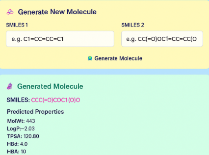

# 🧬 AI-Based Drug Discovery System

This project presents an AI-driven approach for **de novo drug molecule generation and property prediction** using deep learning models.

---

## 📌 Project Objective

To reduce time and cost in traditional drug discovery by:
- Automatically generating novel molecules
- Predicting drug-likeness and molecular properties
- Providing a deployable web-based interface

---

## 🧠 Methodology

- Dataset: ChEMBL
- Molecular representation: SMILES
- Model used:
  - Variational Autoencoder (VAE)
  - Property Prediction Neural Network
- Web deployment using Flask

---

## 🔧 Technologies Used

- Python
- TensorFlow / PyTorch
- RDKit
- Flask
- HTML, CSS

---

## 📊 Results

- Valid molecule generation: **91%**
- Unique molecules: **87%**
- Drug-likeness compliance: **83%**
- Property prediction accuracy: **R² = 0.93**

---

## 📸 Output



---

## ▶️ How to Run

```bash
pip install -r requirements.txt
python app/app.py
```

## 🚀 Applications

- Drug discovery research
- Pharmaceutical R&D
- Academic and research projects
- AI in healthcare

## 👩‍💻 Authors

**Mayank**
**Aastha Agarwal**
